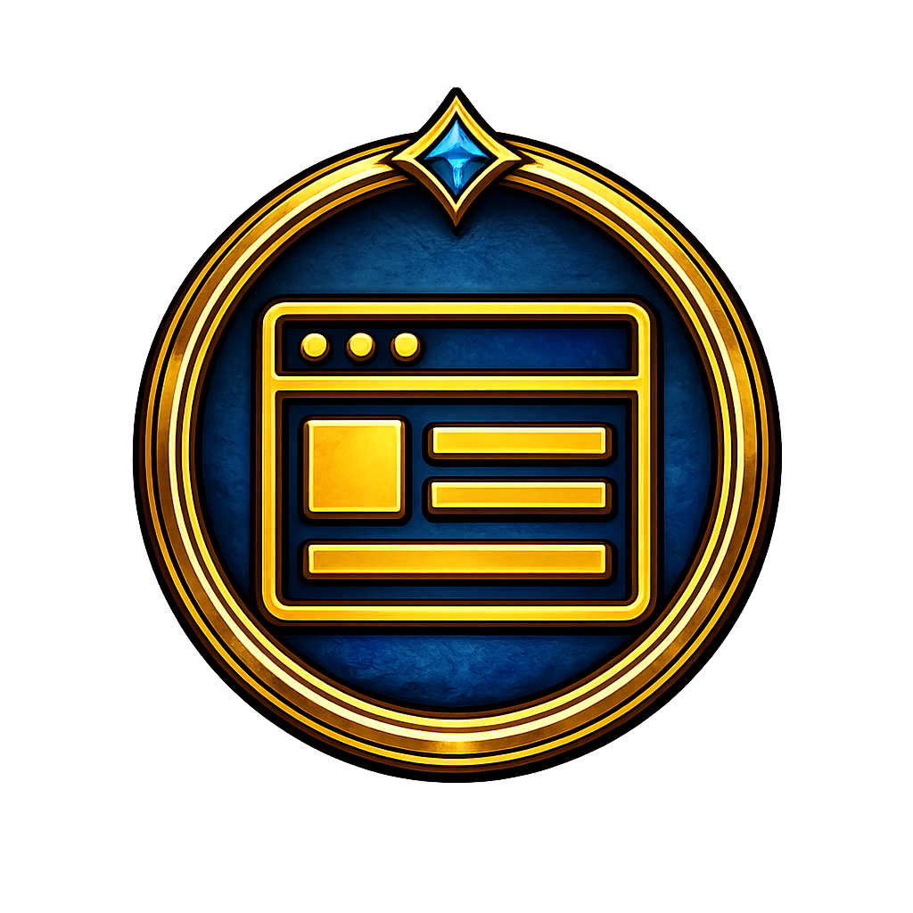

# Nuzi UI

Because the stock frames are fine right up until you actually want them to look useful.

`Nuzi UI` keeps the important frame cleanup in one place:

- styles the stock `player`, `target`, `watchtarget`, `target of target`, and stock `party` frames
- supports optional custom nameplates with matching layout controls
- adds tracked cooldown and effect windows for `player`, `target`, `mount/pet`, `watchtarget`, and `target of target`
- includes target overlay extras, aura layout controls, and a movable launcher icon
- supports backups, imports, and persistent settings in `.data`

## Install

1. Install via Addon Manager.
2. Make sure the addon is enabled in game.
3. Click the launcher icon to show or hide the settings window.

Saved data lives in `nuzi-ui/.data` so your layout, cooldown tracking, and settings survive updates.

## Quick Start

1. Open the `Nuzi UI` settings from the launcher icon.
2. Pick which frame group you want to edit and adjust text, bars, auras, or plates.
3. Enable only the overlays you actually want visible.
4. If you use cooldown tracking, add effects by ID, search, or scan and place each tracker where it fits your UI.

This is the addon version of looking at the stock UI and saying "we can do better than this."

## How To

### Main Frames

The frame editor lets you restyle the stock combat frames without replacing how AAClassic works.

You can adjust:

- text layout, font sizes, and value formatting
- HP and MP bar colors, textures, and spacing
- aura positioning and count
- separate styling for `player`, `target`, `watchtarget`, `target of target`, `party`, or `all frames`

### Nameplates

Nameplates are optional and can be enabled separately from the frame restyle work.

You can:

- show custom raid and party overhead bars
- tune spacing, visibility, and text display
- keep them aligned with the rest of the addon styling

### Cooldowns

The cooldown tracker is built into `Nuzi UI`.

You can:

- track buffs or debuffs on `player`, `target`, `mount/pet`, `watchtarget`, and `target of target`
- add tracked effects by ID, by search, or by scanning a unit
- show active effects, missing effects, or both
- attach non-player trackers near their nameplate and move them with offsets

### Settings And Backups

The settings window also handles profile safety tools.

You can:

- save backups
- list previous backups
- import a backup by index
- keep your UI setup in `.data/settings.txt` instead of shipping someone else's layout

## Notes

- The launcher icon, settings window, overlays, and cooldown trackers all save their positions.
- Cooldown tracker windows for non-player units use nameplate-relative offsets instead of fixed screen coordinates.
- Backup files live in `.data/backups`.
- Moving addon windows follows the same `Shift + drag` behavior as the other Nuzi addons.

## Version

Current version: `2.1.1`
